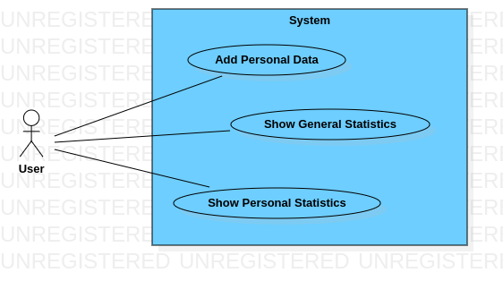
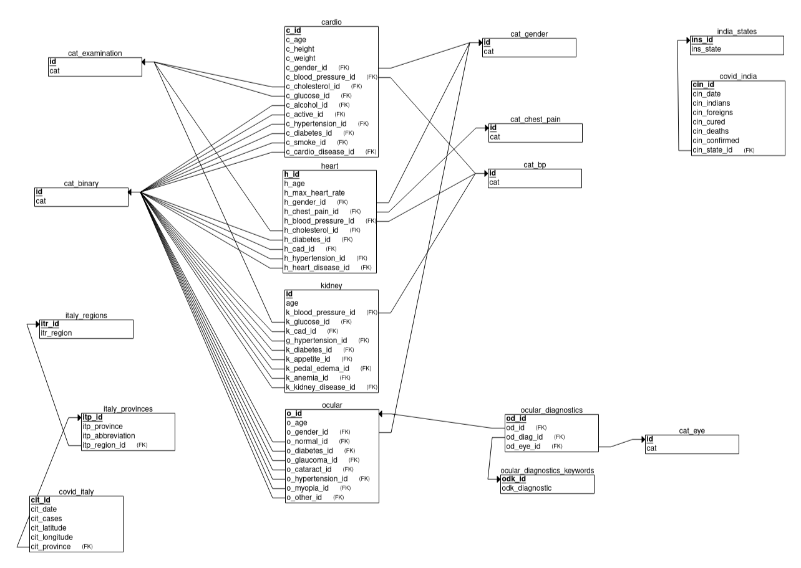

# Disease Info
Simple and lightweight web-application that gives you some statistics about diseases

### Contents
+ [Project Goal](#project-goal)
+ [Project Features](#project-features)
+ [Questions](#questions)
+ [Use Case UML Diagram](#use-case-uml-diagram)
+ [Data](#data)
+ [Entity Relationship Diagram](#entity-relationship-diagram)
+ [Tech](#tech)
+ [Team](#team)

### Project Goal
For obvious reasons, many sick people limit communications, less often appear in crowded places. This might create a false impression of disease statistics. Our mini-project should help to show the real statistics of some diseases and let people to think about their health and lifestyle. 

### Project Features
- **Add Personal Data:** Add personal data, like height, weight, age, diseases. This data will be marked as unconfirmed
- **Show Personal Statistics:** Show statistics, graphs using one's personal data, like what diseases do usually get at this age or location statistics of cases of Covid19 
- **Show General Statistics:** Show general statistics, graphs, some advices

### Questions
1. What is the most common eye disease?
2. What diseases does a middle-aged man suffer from?
3. What is the mean arterial pressure of smokers?
4. What is the percentage of people with myocardial ischemia among those with heart disease?
5. What is the susceptibility of myocardial ischemia by age?
6. What is the most common eye disease in people with diabetes?
7. What percentage of diabetics by gender?
8. What is the most concomitant disease of glaucoma?
9. Is there a correlation between cardiovascular diseases and alcohol, smoking, physical activity?
10. In which region of Italy the least people got sick with covid?
11. On what day was the highest number of cases in Italy?
12. Is there a correlation between the number of cases of covid per day in Italy and India?
13. Which gender is most likely to get sick with each of the diseases?
14. Is there a correlation between different diseases? 
15. Does a person lose appetite with kidney disease?

### Use Case UML Diagram

### Data
- Chronic Kidney Disease:  
  &nbsp;&nbsp;Number of instances: 400  
  &nbsp;&nbsp;[kaggle](https://www.kaggle.com/mansoordaku/ckdisease)  |  [ics.uci.edu](https://archive.ics.uci.edu/ml/datasets/Chronic_Kidney_Disease)

- Ocular Disease:  
  &nbsp;&nbsp;Number of instances: 6392  
  &nbsp;&nbsp;[kaggle](https://www.kaggle.com/andrewmvd/ocular-disease-recognition-odir5k)

- Cardiovascular Disease:  
  &nbsp;&nbsp;Number of instances: 70,000  
  &nbsp;&nbsp;[kaggle](https://www.kaggle.com/sulianova/cardiovascular-disease-dataset)

- Heart Disease:  
  &nbsp;&nbsp;Number of instances: 303  
  &nbsp;&nbsp;[kaggle](https://www.kaggle.com/ronitf/heart-disease-uci)  |  [ics.uci.edu](https://archive.ics.uci.edu/ml/datasets/Heart+Disease)

- Covid19 in India:  
  &nbsp;&nbsp;Number of instances: 9,291  
  &nbsp;&nbsp;[kaggle](https://www.kaggle.com/sudalairajkumar/covid19-in-india)  |  [covid19india.org](https://api.covid19india.org/)

- Covid19 in Italy:  
  &nbsp;&nbsp;Number of instances: 40,200  
  &nbsp;&nbsp;[kaggle](https://www.kaggle.com/sudalairajkumar/covid19-in-italy)  |  [github.com](https://github.com/pcm-dpc/COVID-19)

### Entity Relationship Diagram

Note: as we have many categories, we used Relational Schema, otherwise we would have many relations as "has".

### Tech
- **Backend:** *python3* using *fastapi* framework
- **Frontend:** *vue.js* framework
- **Database:** - *PostgreSQL* because it's free, opensource and has active community. Developers of PostgreSQL speaks at conferences and share the details of the implementation of the base

### Team
Yelmurat Temirgaliyev  
Zhanat Shakimov  
Bislam Makhmutov
