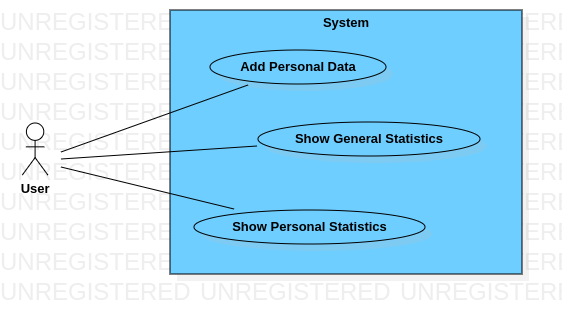
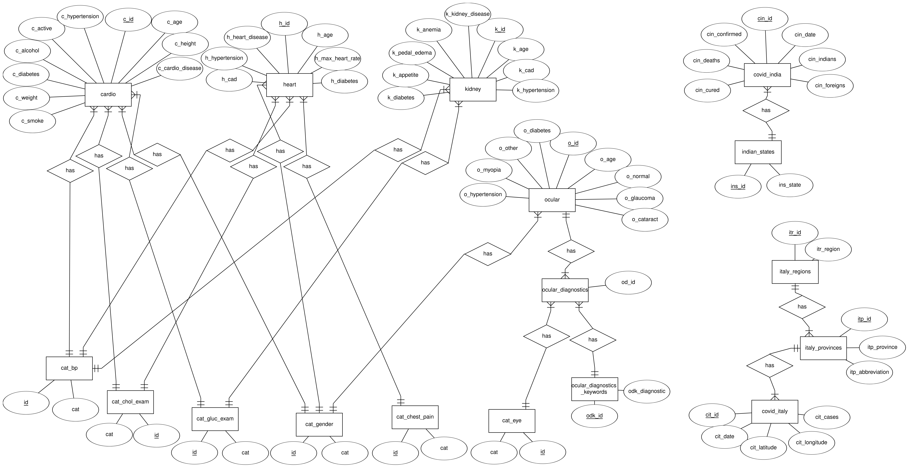

# Disease Info
Simple and lightweight web-application that gives you some statistics about diseases

### Contents
+ [Project Goal](#project-goal)
+ [Project Features](#project-features)
+ [Questions](#questions)
+ [Use Case UML Diagram](#use-case-uml-diagram)
+ [Data](#data)
+ [Entity Relationship Diagram](#entity-relationship-diagram)
+ [Tech](#tech)
+ [Team](#team)

### Project Goal
For obvious reasons, many sick people limit communications, less often appear in crowded places. This might create a false impression of disease statistics. Our mini-project should help to show the real statistics of some diseases and let people to think about their health and lifestyle. 

### Project Features
- **Add Personal Data:** Add personal data, like height, weight, age, diseases. This data will be marked as unconfirmed
- **Show Personal Statistics:** Show statistics, graphs using one's personal data, like what diseases do usually get at this age or location statistics of cases of Covid19 
- **Show General Statistics:** Show general statistics, graphs, some advices

### Questions
1. What is the most common eye disease? [SQL](queries/questions/1.pgsql)
2. What diseases does a middle-aged man suffer from? [SQL](queries/questions/2.pgsql)
3. What is the mean arterial pressure of smokers? [SQL](queries/questions/3.pgsql)
4. What is the percentage of people with myocardial ischemia among those with heart disease? [SQL](queries/questions/4.pgsql)
5. What is the susceptibility of myocardial ischemia by age? [SQL](queries/questions/5.pgsql)
6. What is the most common eye disease in people with diabetes? [SQL](queries/questions/6.pgsql)
7. What percentage of diabetics by gender? [SQL](queries/questions/7.pgsql)
8. What is the most concomitant disease of glaucoma? [SQL](queries/questions/8.pgsql)
9. Is there a correlation between cardiovascular diseases and alcohol, smoking, physical activity? [SQL](queries/questions/9.pgsql)
10. In which region of Italy the least people got sick with covid? [SQL](queries/questions/10.pgsql)
11. On what day was the highest number of cases in Italy? [SQL](queries/questions/11.pgsql)
12. Is there a correlation between the number of cases of covid per day in Italy and India? [SQL](queries/questions/12.pgsql)
13. Which gender is most likely to get sick with each of the diseases? [SQL](queries/questions/13.pgsql)
14. Is there a correlation between different diseases? [SQL](queries/questions/14.pgsql)
15. Does a person lose appetite with kidney disease? [SQL](queries/questions/15.pgsql)
16. How likely to get age-related disease on each eye? [SQL](queries/questions/16.pgsql)
17. How many males has white vessels on their left eye? [SQL](queries/questions/17.pgsql)
18. What blood pressure, cholesterol examination, glucose examination and gender in average has oldest people with cardio disease? [SQL](queries/questions/18.pgsql)
19. what is the distribution of diseases of each eye in different genders? [SQL](queries/questions/19.pgsql)

[Answering queries](queries/questions) 

### Use Case UML Diagram

### Data
- Chronic Kidney Disease:  
  &nbsp;&nbsp;Number of instances: 400  
  &nbsp;&nbsp;source: [kaggle](https://www.kaggle.com/mansoordaku/ckdisease)  |  [ics.uci.edu](https://archive.ics.uci.edu/ml/datasets/Chronic_Kidney_Disease)  
  &nbsp;&nbsp;used: [raw](data/raw/kidney_disease.csv) | [preprocessed](data/preprocessed/kidney.csv)
  
- Ocular Disease:  
  &nbsp;&nbsp;Number of instances: 6392  
  &nbsp;&nbsp;source: [kaggle](https://www.kaggle.com/andrewmvd/ocular-disease-recognition-odir5k)  
  &nbsp;&nbsp;used: [raw](data/raw/ocular_disease.csv) | [preprocessed1](data/preprocessed/ocular.csv) [preprocessed2](data/preprocessed/ocular_diag_keywords.csv) [preprocessed3](data/preprocessed/eye_diagnostics.csv)

- Cardiovascular Disease:  
  &nbsp;&nbsp;Number of instances: 70,000  
  &nbsp;&nbsp;source: [kaggle](https://www.kaggle.com/sulianova/cardiovascular-disease-dataset)  
  &nbsp;&nbsp;used: [raw](data/raw/cardio_train.csv) | [preprocessed](data/preprocessed/cardio.csv)

- Heart Disease:  
  &nbsp;&nbsp;Number of instances: 303  
  &nbsp;&nbsp;source: [kaggle](https://www.kaggle.com/ronitf/heart-disease-uci)  |  [ics.uci.edu](https://archive.ics.uci.edu/ml/datasets/Heart+Disease)  
  &nbsp;&nbsp;used: [raw](data/raw/heart.csv) | [preprocessed](data/preprocessed/heart.csv)

- Covid19 in India:  
  &nbsp;&nbsp;Number of instances: 9,291  
  &nbsp;&nbsp;source: [kaggle](https://www.kaggle.com/sudalairajkumar/covid19-in-india)  |  [covid19india.org](https://api.covid19india.org/)  
  &nbsp;&nbsp;used: [raw](data/raw/covid_19_india.csv) | [preprocessed1](data/preprocessed/covid_india.csv) [preprocessed2](data/preprocessed/indian_states.csv)

- Covid19 in Italy:  
  &nbsp;&nbsp;Number of instances: 40,200  
  &nbsp;&nbsp;source: [kaggle](https://www.kaggle.com/sudalairajkumar/covid19-in-italy)  |  [github.com](https://github.com/pcm-dpc/COVID-19)  
  &nbsp;&nbsp;used: [raw](data/raw/covid19_italy_province.csv) | [preprocessed1](data/preprocessed/covid_italy.csv) [preprocessed2](data/preprocessed/italy_provinces.csv) [preprocessed3](data/preprocessed/italy_regions.csv)  
  
[Preprocessing Script](data/process_data.ipynb)

### Entity Relationship Diagram

Note: as we have many categories, we used Relational Schema, otherwise we would have many relations as "has".

### Tech
- **Backend:** *python3* using *fastapi* framework
- **Frontend:** *vue.js* framework
- **Database:** - *PostgreSQL* because it's free, opensource and has active community. Developers of PostgreSQL speaks at conferences and share the details of the implementation of the base

### Team
Yelmurat Temirgaliyev  
Zhanat Shakimov  
Bislam Makhmutov
